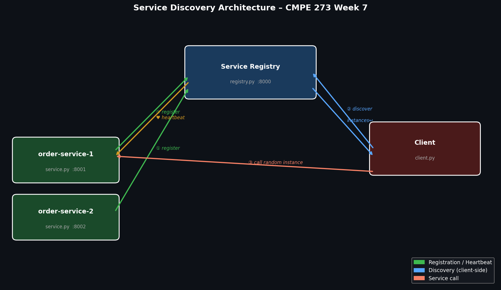

# Service Discovery – CMPE 273 Week 7

A minimal client-side service discovery implementation built with Python + Flask.

## Architecture



| Component | File | Port |
|---|---|---|
| Service Registry | `registry/registry.py` | 8000 |
| Order Service (instance 1) | `service/service.py` | 8001 |
| Order Service (instance 2) | `service/service.py` | 8002 |
| Discovery Client | `client/client.py` | — |

### Flow
1. **Register** — each service instance POSTs to `/register` on startup
2. **Heartbeat** — services send a heartbeat every 10 s; dead instances are pruned automatically after 30 s
3. **Discover** — client GETs `/discover/order-service` to get all live instances
4. **Call** — client picks a random instance (client-side load balancing) and calls it directly

## Run locally

```bash
pip install flask requests
bash run_local.sh
```

## Run with Docker Compose

```bash
docker compose up --build
```

## Registry API

| Method | Endpoint | Description |
|---|---|---|
| POST | `/register` | Register a service instance |
| POST | `/heartbeat` | Refresh instance TTL |
| POST | `/deregister` | Remove an instance |
| GET | `/discover/<name>` | Get all live instances |
| GET | `/services` | List all registered services |

## Key Concepts Demonstrated

- **Naming**: logical name (`order-service`) maps to dynamic network addresses
- **Client-side discovery**: client queries registry and selects an instance
- **Health via heartbeat**: instances that stop sending heartbeats are automatically removed
- **Random load balancing**: client spreads calls across instances with `random.choice`
